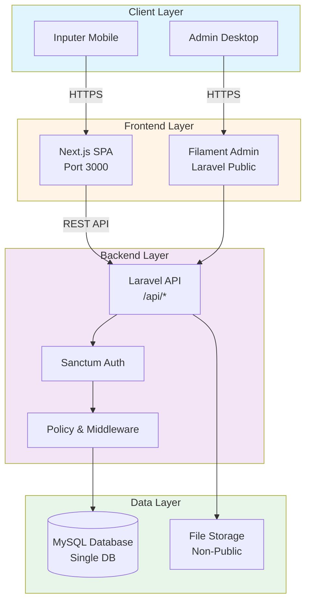
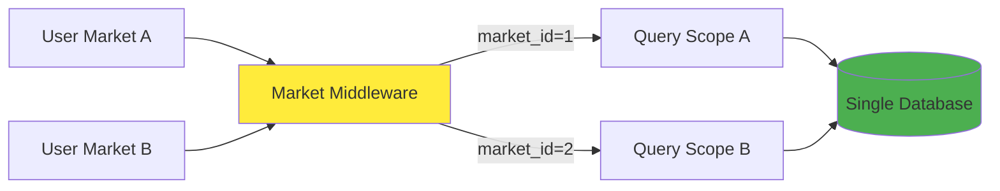

# 01-PROJECT-SPEC.md
# Bukupasar — Project Specification & Architecture

**Single Source of Truth** untuk arsitektur, database, RBAC, dan business rules.

---

## 📋 Table of Contents

1. [Vision & Scope](#vision--scope)
2. [Tech Stack Decisions](#tech-stack-decisions)
3. [System Architecture](#system-architecture)
4. [Domain Modules](#domain-modules)
5. [Database Design](#database-design)
6. [Multi-Tenant Strategy](#multi-tenant-strategy)
7. [RBAC & Access Control](#rbac--access-control)
8. [Business Rules & Validation](#business-rules--validation)
9. [Settings Configuration](#settings-configuration)
10. [Security Considerations](#security-considerations)

---

## 1. Vision & Scope

### Tujuan Aplikasi
Aplikasi web multi-tenant untuk mengelola keuangan pasar tradisional dengan fitur:
- Input pemasukan/pengeluaran kas harian
- Manajemen penyewa kios/lapak (outstanding, pembayaran sewa)
- Laporan keuangan: harian, bulanan, laba rugi, kas
- Multi-pasar dengan admin dan branding independen per pasar
- Mobile-first UX untuk pengguna lansia (inputer)

### Target Users
1. **Admin Pusat** - Kelola multiple pasar, template, audit lintas pasar
2. **Admin Pasar** - Kelola satu pasar: user, data, laporan, settings
3. **Inputer** - Petugas entry data transaksi harian (target: lansia)
4. **Viewer** - Lihat laporan tanpa edit

### MVP Scope (Fase 1)
- ✅ Auth & RBAC (4 roles)
- ✅ Single/Multi pasar (schema siap, implement 1 dulu)
- ✅ Input transaksi: pemasukan, pengeluaran, sewa
- ✅ CRUD Tenants dengan outstanding tracking
- ✅ Laporan: harian, ringkasan, laba rugi
- ✅ Admin panel Filament lengkap
- ✅ SPA Next.js untuk inputer mobile-first
- ⏸️ Excel import (Phase 2)
- ⏸️ Audit logs detail (Phase 2)
- ⏸️ Branding dynamic per pasar (Phase 2)

---

## 2. Tech Stack Decisions

### Backend
- **Framework:** Laravel 11
- **Admin Panel:** Filament 3
- **Database:** MySQL 8
- **ORM:** Eloquent
- **RBAC:** spatie/laravel-permission
- **API:** Laravel Sanctum (token-based auth)
- **Export:** Laravel Excel (PDF/Excel reports)

### Frontend
- **Framework:** Next.js 14 (App Router)
- **Styling:** Tailwind CSS
- **Components:** shadcn/ui
- **Data Fetching:** TanStack Query
- **Forms:** React Hook Form + Zod validation
- **Theme:** Light/Dark mode support

### Infrastructure
- **Development:** Laragon (Windows)
- **Production:** aaPanel VPS
- **Web Server:** Nginx
- **Process Manager:** PM2 (for Next.js)
- **SSL:** Let's Encrypt

### Why This Stack?
- **Laravel + Filament:** Rapid admin panel development
- **Next.js:** Mobile-first, excellent DX, easy deployment
- **Single Database:** Simplify multi-tenant dengan market_id scoping
- **Sanctum:** Simple token auth tanpa OAuth complexity
- **MySQL:** Familiar, reliable, well-supported di aaPanel

---

## 3. System Architecture

### High-Level Architecture



### Request Flow

**Inputer (SPA) → Laravel API:**
1. User login via SPA → POST /api/auth/login
2. Laravel validates → return token + user data
3. SPA stores token in localStorage
4. Subsequent requests include `Authorization: Bearer {token}`
5. Middleware validates token & applies market scoping
6. Controller processes request with market_id filter
7. Response JSON to SPA

**Admin (Filament) → Laravel:**
1. Admin login via Filament auth
2. Session-based auth (cookies)
3. Filament resources auto-apply policy checks
4. Global scope applies market_id filtering
5. Render Filament UI

### Multi-Tenant Architecture



**Key Principles:**
- Single database, kolom `market_id` di semua tabel domain
- Middleware/Global Scope otomatis filter `market_id`
- User login → load market_id → apply ke semua queries
- Isolation: User Market A tidak bisa akses data Market B

---

## 4. Domain Modules

### Auth & User Management
**Tanggung jawab:** Login, logout, session, user CRUD, role assignment

**Entities:**
- `User` (belongs to Market, has Roles)

**Key Features:**
- Login dengan username/password
- Token-based auth untuk SPA (Sanctum)
- Session-based untuk Filament
- Password reset (optional Phase 2)

---

### Markets (Tenant Induk)
**Tanggung jawab:** Manage multiple pasar

**Entities:**
- `Market` (has many Users, Tenants, Categories, Transactions)

**Attributes:**
- name, code (unique), address
- branding: logo_path, color, theme (Phase 2)

**Key Features:**
- Admin pusat kelola markets
- Onboarding wizard (Phase 2)
- Settings per market

---

### Tenants (Penyewa Kios/Lapak)
**Tanggung jawab:** Manage pedagang penyewa

**Entities:**
- `Tenant` (belongs to Market, has many Payments)

**Attributes:**
- nama, nomor_lapak (unique per market)
- hp, alamat, foto_profile, foto_ktp
- outstanding (sisa tunggakan sewa)

**Key Features:**
- CRUD tenants
- Autosuggest nomor lapak di form sewa
- Outstanding tracking
- Payment history

---

### Categories
**Tanggung jawab:** Kategori pemasukan/pengeluaran

**Entities:**
- `Category` (belongs to Market)

**Attributes:**
- jenis: 'pemasukan' | 'pengeluaran'
- nama (unique per market + jenis)
- wajib_keterangan: boolean
- aktif: boolean

**Default Categories:**
- **Pemasukan:** Retribusi, Parkir, Sewa, Pendapatan Lain
- **Pengeluaran:** Operasional, Kebersihan, Honor, Pemeliharaan, Lainnya

**Key Features:**
- Admin pasar kelola categories
- Flag wajib_keterangan untuk validasi
- Flag aktif untuk hide/show

---

### Transactions (Kas Harian)
**Tanggung jawab:** Input pemasukan/pengeluaran

**Entities:**
- `Transaction` (belongs to Market, User, optional Tenant)

**Attributes:**
- tanggal, jenis, subkategori, jumlah
- tenant_id (for sewa)
- created_by (user_id)
- catatan (optional)

**Key Features:**
- Input pemasukan/pengeluaran
- Validasi backdate
- Validasi hari allowed (configurable)
- Inputer bisa edit/delete dalam 24 jam
- Admin bisa edit kapan pun

---

### Payments (Pembayaran Sewa)
**Tanggung jawab:** Bayar tunggakan sewa

**Entities:**
- `Payment` (belongs to Market, Tenant, User)

**Attributes:**
- tenant_id, tanggal, jumlah
- created_by
- catatan

**Key Features:**
- Validasi: jumlah ≤ outstanding
- Update outstanding after payment
- Transactional (DB transaction)
- Audit log

---

### Reports
**Tanggung jawab:** Generate laporan

**Types:**
1. **Laporan Harian** - Transactions per tanggal
2. **Laporan Ringkasan** - Total per range date
3. **Laporan Kas** - Debit/Kredit/Saldo
4. **Laba Rugi** - Pemasukan - Pengeluaran per bulan

**Export:**
- PDF (dengan branding pasar)
- Excel

---

### Settings
**Tanggung jawab:** Konfigurasi per market

**Storage:** Key-value table `settings(market_id, key_name, value)`

**Key Settings:** (see Section 9)

---

### Audit Logs
**Tanggung jawab:** Track important actions

**Attributes:**
- user_id, market_id, action, entity, entity_id, details

**Actions:**
- CREATE, UPDATE, DELETE, APPROVE, RESTORE

**Phase 2:** Comprehensive audit trail

---

### Uploads
**Tanggung jawab:** File management

**Entities:**
- `Upload` (belongs to Market, User)

**Attributes:**
- path, mime, size

**Storage:**
- Non-public folder: `storage/markets/{market_id}/`
- Access via authenticated route

---

## 5. Database Design

### ERD

```mermaid
erDiagram
    MARKETS ||--o{ USERS : "has"
    MARKETS ||--o{ TENANTS : "has"
    MARKETS ||--o{ CATEGORIES : "has"
    MARKETS ||--o{ TRANSACTIONS : "has"
    MARKETS ||--o{ PAYMENTS : "has"
    MARKETS ||--o{ SETTINGS : "has"
    
    USERS ||--o{ TRANSACTIONS : "created_by"
    USERS ||--o{ PAYMENTS : "created_by"
    
    TENANTS ||--o{ TRANSACTIONS : "linked"
    TENANTS ||--o{ PAYMENTS : "pays"
    
    MARKETS {
        int id PK
        string name
        string code UK
        text address
        timestamp created_at
    }
    
    USERS {
        int id PK
        int market_id FK
        string username
        string name
        string password
        string email
        string phone
        timestamp created_at
    }
    
    TENANTS {
        int id PK
        int market_id FK
        string nama
        string nomor_lapak UK_per_market
        string hp
        text alamat
        string foto_profile
        string foto_ktp
        bigint outstanding
        timestamp created_at
    }
    
    CATEGORIES {
        int id PK
        int market_id FK
        enum jenis
        string nama UK_per_market_jenis
        boolean wajib_keterangan
        boolean aktif
        timestamp created_at
    }
    
    TRANSACTIONS {
        int id PK
        int market_id FK
        date tanggal
        enum jenis
        string subkategori
        bigint jumlah
        int tenant_id FK_nullable
        int created_by FK
        text catatan
        timestamp created_at
    }
    
    PAYMENTS {
        int id PK
        int market_id FK
        int tenant_id FK
        date tanggal
        bigint jumlah
        int created_by FK
        text catatan
        timestamp created_at
    }
    
    SETTINGS {
        int market_id FK PK
        string key_name PK
        text value
        timestamp updated_at
    }
    
    AUDIT_LOGS {
        int id PK
        int market_id FK
        int user_id FK
        string action
        string entity
        int entity_id
        text details
        timestamp created_at
    }
    
    UPLOADS {
        int id PK
        int market_id FK
        int user_id FK
        string path
        string mime
        int size
        timestamp created_at
    }
```

### Complete DDL (MySQL 8)

```sql
-- ============================================================
-- MARKETS TABLE
-- ============================================================
CREATE TABLE IF NOT EXISTS markets (
  id INT AUTO_INCREMENT PRIMARY KEY,
  name VARCHAR(150) NOT NULL,
  code VARCHAR(50) NOT NULL UNIQUE,
  address TEXT NULL,
  created_at TIMESTAMP NULL DEFAULT CURRENT_TIMESTAMP,
  updated_at TIMESTAMP NULL DEFAULT CURRENT_TIMESTAMP ON UPDATE CURRENT_TIMESTAMP
) ENGINE=InnoDB DEFAULT CHARSET=utf8mb4 COLLATE=utf8mb4_unicode_ci;

-- ============================================================
-- USERS TABLE
-- ============================================================
CREATE TABLE IF NOT EXISTS users (
  id INT AUTO_INCREMENT PRIMARY KEY,
  market_id INT NOT NULL,
  username VARCHAR(100) NOT NULL,
  name VARCHAR(150) NOT NULL,
  password VARCHAR(255) NOT NULL,
  email VARCHAR(150) NULL,
  phone VARCHAR(50) NULL,
  created_at TIMESTAMP NULL DEFAULT CURRENT_TIMESTAMP,
  updated_at TIMESTAMP NULL DEFAULT CURRENT_TIMESTAMP ON UPDATE CURRENT_TIMESTAMP,
  
  CONSTRAINT fk_users_market 
    FOREIGN KEY (market_id) REFERENCES markets(id) 
    ON DELETE RESTRICT ON UPDATE CASCADE,
  CONSTRAINT uq_users_market_username 
    UNIQUE (market_id, username),
  INDEX idx_users_market (market_id)
) ENGINE=InnoDB DEFAULT CHARSET=utf8mb4 COLLATE=utf8mb4_unicode_ci;

-- ============================================================
-- TENANTS TABLE
-- ============================================================
CREATE TABLE IF NOT EXISTS tenants (
  id INT AUTO_INCREMENT PRIMARY KEY,
  market_id INT NOT NULL,
  nama VARCHAR(200) NOT NULL,
  nomor_lapak VARCHAR(50) NOT NULL,
  hp VARCHAR(30) NULL,
  alamat TEXT NULL,
  foto_profile VARCHAR(255) NULL,
  foto_ktp VARCHAR(255) NULL,
  outstanding BIGINT NOT NULL DEFAULT 0,
  created_at TIMESTAMP NULL DEFAULT CURRENT_TIMESTAMP,
  updated_at TIMESTAMP NULL DEFAULT CURRENT_TIMESTAMP ON UPDATE CURRENT_TIMESTAMP,
  
  CONSTRAINT fk_tenants_market 
    FOREIGN KEY (market_id) REFERENCES markets(id) 
    ON DELETE RESTRICT ON UPDATE CASCADE,
  CONSTRAINT uq_tenants_market_lapak 
    UNIQUE (market_id, nomor_lapak),
  INDEX idx_tenants_market_created (market_id, created_at)
) ENGINE=InnoDB DEFAULT CHARSET=utf8mb4 COLLATE=utf8mb4_unicode_ci;

-- ============================================================
-- CATEGORIES TABLE
-- ============================================================
CREATE TABLE IF NOT EXISTS categories (
  id INT AUTO_INCREMENT PRIMARY KEY,
  market_id INT NOT NULL,
  jenis ENUM('pemasukan','pengeluaran') NOT NULL,
  nama VARCHAR(100) NOT NULL,
  wajib_keterangan TINYINT(1) NOT NULL DEFAULT 0,
  aktif TINYINT(1) NOT NULL DEFAULT 1,
  created_at TIMESTAMP NULL DEFAULT CURRENT_TIMESTAMP,
  updated_at TIMESTAMP NULL DEFAULT CURRENT_TIMESTAMP ON UPDATE CURRENT_TIMESTAMP,
  
  CONSTRAINT fk_categories_market 
    FOREIGN KEY (market_id) REFERENCES markets(id) 
    ON DELETE RESTRICT ON UPDATE CASCADE,
  CONSTRAINT uq_categories_market_jenis_nama 
    UNIQUE (market_id, jenis, nama),
  INDEX idx_categories_market (market_id)
) ENGINE=InnoDB DEFAULT CHARSET=utf8mb4 COLLATE=utf8mb4_unicode_ci;

-- ============================================================
-- TRANSACTIONS TABLE
-- ============================================================
CREATE TABLE IF NOT EXISTS transactions (
  id INT AUTO_INCREMENT PRIMARY KEY,
  market_id INT NOT NULL,
  tanggal DATE NOT NULL,
  jenis ENUM('pemasukan','pengeluaran') NOT NULL,
  subkategori VARCHAR(100) NOT NULL,
  jumlah BIGINT NOT NULL,
  tenant_id INT NULL,
  created_by INT NOT NULL,
  catatan TEXT NULL,
  created_at TIMESTAMP NULL DEFAULT CURRENT_TIMESTAMP,
  updated_at TIMESTAMP NULL DEFAULT CURRENT_TIMESTAMP ON UPDATE CURRENT_TIMESTAMP,
  
  CONSTRAINT fk_transactions_market 
    FOREIGN KEY (market_id) REFERENCES markets(id) 
    ON DELETE RESTRICT ON UPDATE CASCADE,
  CONSTRAINT fk_transactions_tenant 
    FOREIGN KEY (tenant_id) REFERENCES tenants(id) 
    ON DELETE RESTRICT ON UPDATE CASCADE,
  CONSTRAINT fk_transactions_user 
    FOREIGN KEY (created_by) REFERENCES users(id) 
    ON DELETE RESTRICT ON UPDATE CASCADE,
    
  INDEX idx_transactions_market_date (market_id, tanggal),
  INDEX idx_transactions_market_creator (market_id, created_by),
  INDEX idx_transactions_market_jenis (market_id, jenis)
) ENGINE=InnoDB DEFAULT CHARSET=utf8mb4 COLLATE=utf8mb4_unicode_ci;

-- ============================================================
-- PAYMENTS TABLE
-- ============================================================
CREATE TABLE IF NOT EXISTS payments (
  id INT AUTO_INCREMENT PRIMARY KEY,
  market_id INT NOT NULL,
  tenant_id INT NOT NULL,
  tanggal DATE NOT NULL,
  jumlah BIGINT NOT NULL,
  created_by INT NOT NULL,
  catatan TEXT NULL,
  created_at TIMESTAMP NULL DEFAULT CURRENT_TIMESTAMP,
  
  CONSTRAINT fk_payments_market 
    FOREIGN KEY (market_id) REFERENCES markets(id) 
    ON DELETE RESTRICT ON UPDATE CASCADE,
  CONSTRAINT fk_payments_tenant 
    FOREIGN KEY (tenant_id) REFERENCES tenants(id) 
    ON DELETE RESTRICT ON UPDATE CASCADE,
  CONSTRAINT fk_payments_user 
    FOREIGN KEY (created_by) REFERENCES users(id) 
    ON DELETE RESTRICT ON UPDATE CASCADE,
    
  INDEX idx_payments_market_date (market_id, tanggal),
  INDEX idx_payments_market_tenant (market_id, tenant_id)
) ENGINE=InnoDB DEFAULT CHARSET=utf8mb4 COLLATE=utf8mb4_unicode_ci;

-- ============================================================
-- SETTINGS TABLE
-- ============================================================
CREATE TABLE IF NOT EXISTS settings (
  market_id INT NOT NULL,
  key_name VARCHAR(100) NOT NULL,
  value TEXT NULL,
  updated_at TIMESTAMP NULL DEFAULT CURRENT_TIMESTAMP ON UPDATE CURRENT_TIMESTAMP,
  
  PRIMARY KEY (market_id, key_name),
  CONSTRAINT fk_settings_market 
    FOREIGN KEY (market_id) REFERENCES markets(id) 
    ON DELETE RESTRICT ON UPDATE CASCADE,
  INDEX idx_settings_market (market_id)
) ENGINE=InnoDB DEFAULT CHARSET=utf8mb4 COLLATE=utf8mb4_unicode_ci;

-- ============================================================
-- AUDIT_LOGS TABLE
-- ============================================================
CREATE TABLE IF NOT EXISTS audit_logs (
  id INT AUTO_INCREMENT PRIMARY KEY,
  market_id INT NOT NULL,
  user_id INT NOT NULL,
  action VARCHAR(100) NOT NULL,
  entity VARCHAR(100) NOT NULL,
  entity_id INT NULL,
  details TEXT NULL,
  created_at TIMESTAMP NULL DEFAULT CURRENT_TIMESTAMP,
  
  CONSTRAINT fk_audit_market 
    FOREIGN KEY (market_id) REFERENCES markets(id) 
    ON DELETE RESTRICT ON UPDATE CASCADE,
  CONSTRAINT fk_audit_user 
    FOREIGN KEY (user_id) REFERENCES users(id) 
    ON DELETE RESTRICT ON UPDATE CASCADE,
    
  INDEX idx_audit_market_time (market_id, created_at),
  INDEX idx_audit_entity (entity, entity_id)
) ENGINE=InnoDB DEFAULT CHARSET=utf8mb4 COLLATE=utf8mb4_unicode_ci;

-- ============================================================
-- UPLOADS TABLE
-- ============================================================
CREATE TABLE IF NOT EXISTS uploads (
  id INT AUTO_INCREMENT PRIMARY KEY,
  market_id INT NOT NULL,
  user_id INT NOT NULL,
  path VARCHAR(255) NOT NULL,
  mime VARCHAR(100) NOT NULL,
  size INT NOT NULL,
  created_at TIMESTAMP NULL DEFAULT CURRENT_TIMESTAMP,
  
  CONSTRAINT fk_uploads_market 
    FOREIGN KEY (market_id) REFERENCES markets(id) 
    ON DELETE RESTRICT ON UPDATE CASCADE,
  CONSTRAINT fk_uploads_user 
    FOREIGN KEY (user_id) REFERENCES users(id) 
    ON DELETE RESTRICT ON UPDATE CASCADE,
    
  INDEX idx_uploads_market_time (market_id, created_at)
) ENGINE=InnoDB DEFAULT CHARSET=utf8mb4 COLLATE=utf8mb4_unicode_ci;
```

### Key Indexes

**Performance Optimization:**
- `market_id` indexed di semua tabel domain (frequently filtered)
- Composite index `(market_id, tanggal)` untuk queries laporan
- Composite index `(market_id, created_at)` untuk sorting
- Unique constraints per market untuk data isolation

---

## 6. Multi-Tenant Strategy

### Single Database Approach

**Advantages:**
- ✅ Simple setup dan maintenance
- ✅ Easy backup & restore
- ✅ Cost-effective (1 database)
- ✅ Easy untuk agregasi lintas pasar
- ✅ Schema changes propagate ke semua tenant

**Implementation:**
1. Kolom `market_id` di semua tabel domain
2. Global scope di Eloquent Models
3. Middleware untuk set market context
4. Policy untuk enforce market isolation

### Market Scoping Strategy

**Laravel Global Scope:**
```php
// App/Models/Scopes/MarketScope.php
class MarketScope implements Scope
{
    public function apply(Builder $builder, Model $model)
    {
        if (auth()->check() && auth()->user()->market_id) {
            $builder->where('market_id', auth()->user()->market_id);
        }
    }
}

// Usage in Model
protected static function booted()
{
    static::addGlobalScope(new MarketScope);
}
```

**Middleware:**
```php
// Set market context dari user login
$request->attributes->set('market_id', auth()->user()->market_id);
```

### Data Isolation

**Rules:**
- User di Market A **tidak bisa akses** data Market B
- Admin Pusat bisa switch market context (special permission)
- Queries tanpa `market_id` filter → throw exception (fail-safe)
- File uploads segregated: `storage/markets/{market_id}/`

---

## 7. RBAC & Access Control

### Roles (using spatie/laravel-permission)

| Role | Description | Access Level |
|------|-------------|--------------|
| **admin_pusat** | Super admin, kelola semua pasar | Global (all markets) |
| **admin_pasar** | Admin satu pasar | Market-scoped |
| **inputer** | Petugas input transaksi | Market-scoped, limited |
| **viewer** | Lihat laporan saja | Market-scoped, read-only |

### Permissions Matrix

| Module | admin_pusat | admin_pasar | inputer | viewer |
|--------|-------------|-------------|---------|--------|
| **Markets** | | | | |
| - View all markets | ✅ | ❌ | ❌ | ❌ |
| - Create market | ✅ | ❌ | ❌ | ❌ |
| - Edit market | ✅ | ❌ | ❌ | ❌ |
| **Users** | | | | |
| - View users | ✅ | ✅ (own market) | ❌ | ❌ |
| - Create user | ✅ | ✅ (own market) | ❌ | ❌ |
| - Edit user | ✅ | ✅ (own market) | ❌ | ❌ |
| - Delete user | ✅ | ✅ (own market) | ❌ | ❌ |
| **Categories** | | | | |
| - View | ✅ | ✅ | ✅ | ✅ |
| - Create/Edit | ✅ | ✅ | ❌ | ❌ |
| **Tenants** | | | | |
| - View | ✅ | ✅ | ✅ | ✅ |
| - Create | ✅ | ✅ | ❌ | ❌ |
| - Edit | ✅ | ✅ | ❌ | ❌ |
| - Delete | ✅ | ✅ | ❌ | ❌ |
| **Transactions** | | | | |
| - View all | ✅ | ✅ | ✅ (own) | ✅ |
| - Create | ✅ | ✅ | ✅ | ❌ |
| - Edit any | ✅ | ✅ | ❌ | ❌ |
| - Edit own (24h) | ✅ | ✅ | ✅ | ❌ |
| - Delete any | ✅ | ✅ | ❌ | ❌ |
| - Delete own (24h) | ✅ | ✅ | ✅ | ❌ |
| **Payments** | | | | |
| - View | ✅ | ✅ | ✅ | ✅ |
| - Create | ✅ | ✅ | ✅ | ❌ |
| - Edit | ✅ | ✅ | ❌ | ❌ |
| **Reports** | | | | |
| - View | ✅ | ✅ | ✅ | ✅ |
| - Export | ✅ | ✅ | ❌ | ❌ |
| **Settings** | | | | |
| - View | ✅ | ✅ | ❌ | ❌ |
| - Edit | ✅ | ✅ | ❌ | ❌ |

### Permission Naming Convention

```
{module}.{action}

Examples:
- transactions.view
- transactions.create
- transactions.edit
- transactions.delete
- transactions.edit-own
- reports.view
- reports.export
- settings.manage
```

### Policy Rules

**TransactionPolicy:**
```php
public function update(User $user, Transaction $transaction)
{
    // Admin always can
    if ($user->hasRole(['admin_pusat', 'admin_pasar'])) {
        return true;
    }
    
    // Inputer can edit own within 24 hours
    if ($user->hasRole('inputer')) {
        $isOwner = $transaction->created_by === $user->id;
        $within24h = $transaction->created_at->diffInHours(now()) <= 24;
        return $isOwner && $within24h;
    }
    
    return false;
}
```

---

## 8. Business Rules & Validation

### Transaction Input Rules

**1. Tanggal Validation**
- Default: hari ini
- Backdate allowed: max `backdate_days` (default 60 hari)
- Future date: not allowed
- Hari allowed: configurable per market
  - Mode 'everyday': semua hari boleh
  - Mode 'selected': hanya hari tertentu (ISO weekday: 1=Senin, 7=Minggu)

**2. Jenis & Kategori**
- Jenis: 'pemasukan' atau 'pengeluaran' (required)
- Subkategori: harus exist di categories table untuk market tersebut
- Kategori aktif = 1 (nonaktif tidak muncul di dropdown)

**3. Nominal**
- Required
- Must be > 0
- Format: integer (Rupiah dalam sen, atau bigint tanpa desimal)

**4. Keterangan**
- Optional by default
- Required jika `categories.wajib_keterangan = 1`

**5. Tenant (untuk Sewa)**
- Required jika subkategori = 'Sewa'
- Must exist dan belong to same market

### Payment Rules

**1. Outstanding Validation**
- Jumlah payment ≤ tenant.outstanding
- Error message jelas: "Pembayaran melebihi tunggakan. Maksimal Rp X"

**2. Transaction Process**
```
BEGIN TRANSACTION
  1. INSERT into payments
  2. UPDATE tenants SET outstanding = outstanding - jumlah
  3. INSERT audit_log
COMMIT
```

**3. Concurrency**
- Use SELECT ... FOR UPDATE on tenants row
- Prevent race condition pada update outstanding

### Edit Window Rules

**Inputer Edit Window:**
- Can edit/delete own transactions within `inputer_edit_window_hours` (default 24h)
- After window: read-only untuk inputer
- Admin always can edit

**Lock Period (Optional):**
- Admin can set lock date per market
- Transactions before lock date: read-only for inputer
- Admin can still edit (logged in audit)

---

## 9. Settings Configuration

### Settings Storage
Key-value table with composite PK `(market_id, key_name)`

### Core Settings Keys

| Key | Type | Default | Description |
|-----|------|---------|-------------|
| **Input Rules** | | | |
| `allowed_days_mode` | enum | 'everyday' | 'everyday' or 'selected' |
| `allowed_days_values` | string | '' | CSV ISO weekday if mode='selected' (e.g., "1,3,4,6") |
| `backdate_days` | int | 60 | Max backdate allowed |
| `inputer_edit_window_hours` | int | 24 | Edit window untuk inputer |
| **Validation** | | | |
| `enforce_allowed_days` | bool | 1 | Block (1) or warn (0) |
| `enforce_backdate` | bool | 1 | Block (1) or warn (0) |
| `enforce_payment_limit` | bool | 1 | Block payment > outstanding |
| **Limits (Optional)** | | | |
| `monthly_spending_limit_enabled` | bool | 0 | Enable spending limit reminder |
| `monthly_spending_limit_value` | bigint | 10000000 | Limit value if enabled |
| `warning_threshold_percent` | int | 70 | Warning at X% of limit |
| **Timezone** | | | |
| `market_timezone` | string | 'Asia/Jakarta' | Timezone untuk date operations |
| **Reports** | | | |
| `report_currency_code` | string | 'IDR' | Currency for formatting |
| `report_locale` | string | 'id-ID' | Locale for number formatting |
| **Branding (Phase 2)** | | | |
| `branding_name` | string | null | Display name |
| `branding_color` | string | '#0ea5e9' | Primary color |
| `branding_logo_path` | string | null | Logo file path |

### Settings Helper (Laravel)

```php
// Get setting for current market
function market_setting($key, $default = null) {
    $marketId = auth()->user()->market_id;
    $setting = Setting::where('market_id', $marketId)
                      ->where('key_name', $key)
                      ->first();
    return $setting ? $setting->value : $default;
}

// Usage
$backdateDays = market_setting('backdate_days', 60);
```

---

## 10. Security Considerations

### Authentication
- ✅ Password hashed dengan bcrypt (Laravel default)
- ✅ Token-based auth untuk SPA (Laravel Sanctum)
- ✅ Session-based untuk Filament (HTTPOnly, Secure cookies)
- ✅ CSRF protection enabled
- ⚠️ Rate limiting pada login endpoint (10 attempts/minute)

### Authorization
- ✅ Policy checks pada every controller action
- ✅ Global scope prevents cross-market data access
- ✅ Middleware validates market_id
- ✅ Filament resources use `can()` checks

### Data Validation
- ✅ Server-side validation (never trust client)
- ✅ SQL injection prevention (Eloquent parameterized queries)
- ✅ XSS prevention (Laravel auto-escapes blade)
- ✅ File upload validation (MIME, size, extension)

### File Uploads
- ✅ Non-public storage (`storage/app/` not `public/`)
- ✅ Access via authenticated route
- ✅ MIME type validation
- ✅ File size limit (2MB for images)
- ✅ Rename file to UUID (prevent overwrite/guessing)

### API Security
- ✅ HTTPS only (production)
- ✅ CORS configured (only allow SPA domain)
- ✅ Token expiration (Sanctum default: no expiry, consider adding)
- ✅ Rate limiting per endpoint

### Database Security
- ✅ Separate DB user dengan minimal privileges
- ✅ No direct DB access from public
- ✅ Regular backups (daily)
- ✅ Connection over SSL (production)

---

## 📝 Change Log

- **2025-01-15:** Initial spec based on readme-original.md
- **2025-01-15:** Simplified for 5-file documentation structure

---

## 📚 Related Documents

- [02-BACKEND-GUIDE.md](02-BACKEND-GUIDE.md) - Laravel implementation
- [03-FRONTEND-GUIDE.md](03-FRONTEND-GUIDE.md) - Next.js implementation
- [05-AI-ASSISTANT-GUIDE.md](05-AI-ASSISTANT-GUIDE.md) - AI prompts & workflow
- [TO-DO-LIST.md](TO-DO-LIST.md) - Progress tracker

---

**Document Status:** ✅ Complete | **Last Updated:** 2025-01-15
